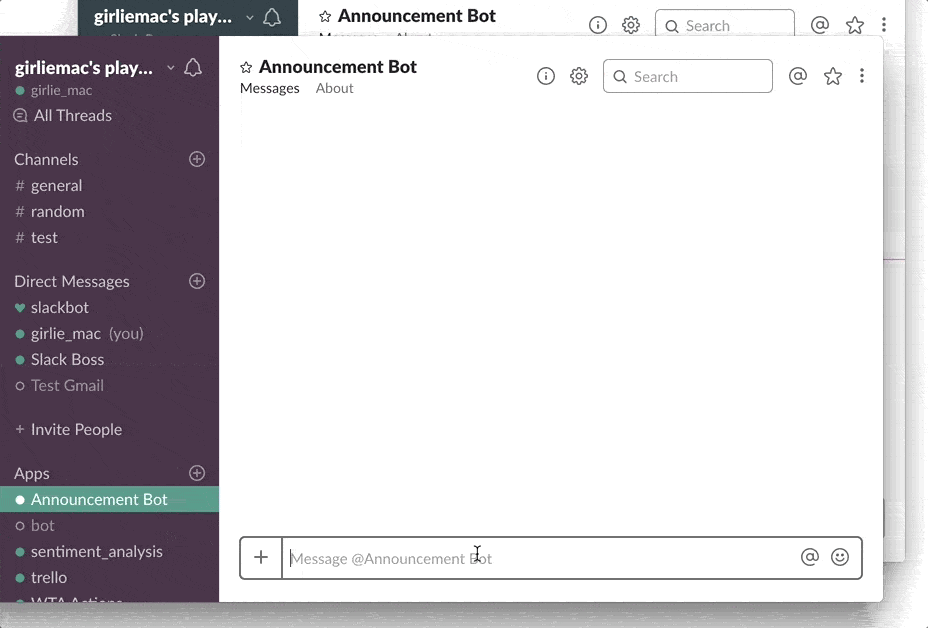
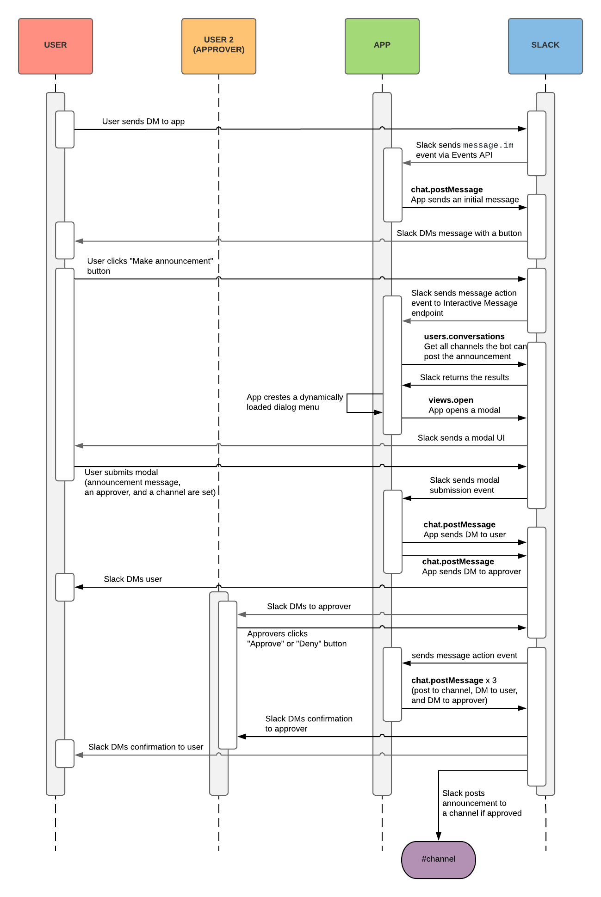

# Approval Workflows with AnnounceBot

*Updated August 2018: As we have introduced the workspace app (currently in beta), this tutorial and the code samples have been updated using the new token model! All the changes from the previous version of this example, read the [diff.md](diff.md)*

*Learn more about the workspace app at the [Slack API doc](https://api.slack.com/workspace-apps-preview).*

This app will send announcements into a channel of your choice. Users can DM this app to get their announcements into a review queue. Once the approver gives the thumbs up, the announcement will be posted to public.

User A ("girlie_mac") wants to announce about donuts on `#random` channel, and User B ("Slack Boss") approves it:

## Setup

#### Create a Slack app

1. Create a *workspace app* at (https://api.slack.com/apps?new_app_token=1)[https://api.slack.com/apps?new_app_token=1]
1. Navigate to the OAuth & Permissions page and add the following scopes:
    * `chat:write`
    * `conversations.app_home:create`
    * `conversations:read`
1. Enable the events (See below *Enable the Events API*)
1. Enable the interactive messages (See below *Enable Interactive Messages*)
1. Click 'Save Changes' and install the app
1. Click 'Save Changes' and install the app (You should get an OAuth access token after the installation

#### Run locally or 
1. Get the code
    * Either clone this repo and run `npm install`
    * Or visit https://glitch.com/edit/#!/remix/slack-announcements-approval-blueprint
1. Set the following environment variables in `.env` (copy from `.env.sample`):
    * `SLACK_ACCESS_TOKEN`: Your app's `xoxa-` token (available on the Install App page after the installation)
    * `SLACK_SIGNING_SECRET`: Your app's Signing Secret (available on the **Basic Information** page)
1. If you're running the app locally:
    * Start the app (`npm start`)

#### Enable the Events API
1. Go back to the app settings and click on **Events Subscriptions**
1. Set the Request URL to your server (*e.g.* `https://yourname.ngrok.com`) or Glitch URL + `/events`
1. On the same page, subscribe to the `message.app_home` events

#### Enable Interactive Messages
1. In the app settings, click on Interactive Components
1. Set the Request URL to your server or Glitch URL + `/interactions`

## The app sequence diagram

